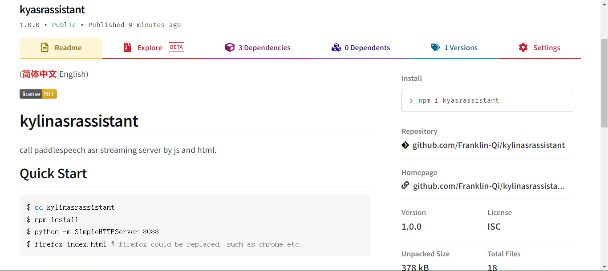

(简体中文|[English](./README.md))

<a href="./LICENSE"></a>

# kylinasrassistant

通过js、html 调用`paddlespeech`的实时语音识别服务。

## 快速开始
### 从git快速开始
```shell
$ cd kylinasrassistant
$ npm install
$ python -m SimpleHTTPServer 8088 
$ firefox index.html # firefox could be replaced, such as chrome etc.
```
通过以上操作可以启动本地服务。浏览器上输入: `http://localhost:8088/` 来显示页面。

### 从npm快速开始
```shell
$ mkdir kylinasrassistant
$ npm install kyasrassistant && cd ./node_modules/kylinasrassistant
$ npm install # install dependencies
$ python -m SimpleHTTPServer 8088 
$ firefox index.html # firefox could be replaced, such as chrome etc.
```
通过以上操作可以启动本地服务。浏览器上输入: `http://localhost:8088/` 来显示页面。



## 贡献者

yushuoqi, liucong

## License

kylinasrassistant 在 [MIT 许可](./LICENSE) 下提供。
